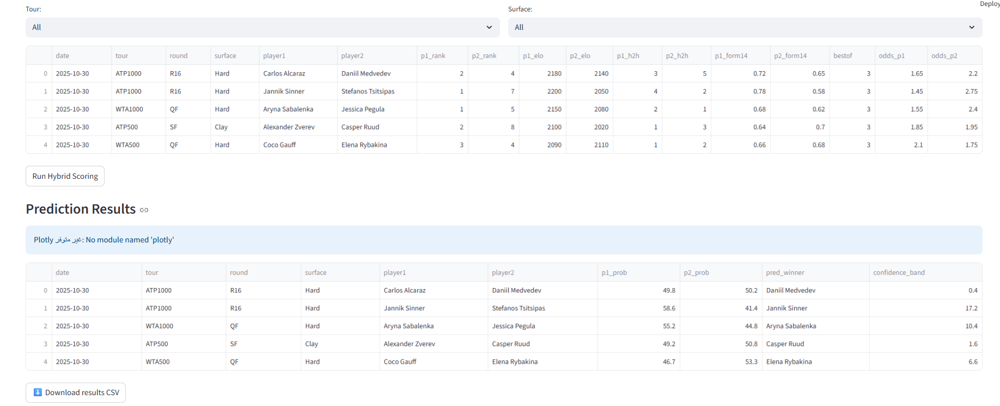

# 🎾 TennisPredictorX — Demo (FOR + UTFP)

## Quick Start
~~~powershell
python -m venv .venv
.\.venv\Scripts\activate
pip install -r requirements.txt
streamlit run app\streamlit_app.py
~~~

## Minimum Schema (Min-5)
| Column | Description |
|---|---|
| match_date | Date of match (YYYY-MM-DD) |
| tour | e.g., ATP1000 / WTA500 |
| surface | Hard / Clay / Grass |
| player1 / player2 | Player names |
| elo_p1 / elo_p2 | Elo ratings |
| rank_p1 / rank_p2 | Rankings |
| h2h_p1 / h2h_p2 | Head-to-Head counts |
| form14_p1 / form14_p2 | Recent form ratio |
| odds_p1 / odds_p2 | Decimal odds |

## Tests
- Tour = ATP1000 → 2 matches
- Surface = Clay → 1 match
- CSV Download works

## Output Columns
`p1_prob`, `p2_prob`, `pred_winner`, `confidence_band`

## Screenshots

   
  <em>Home screen</em>

   
  <em>Hybrid scoring results</em>

