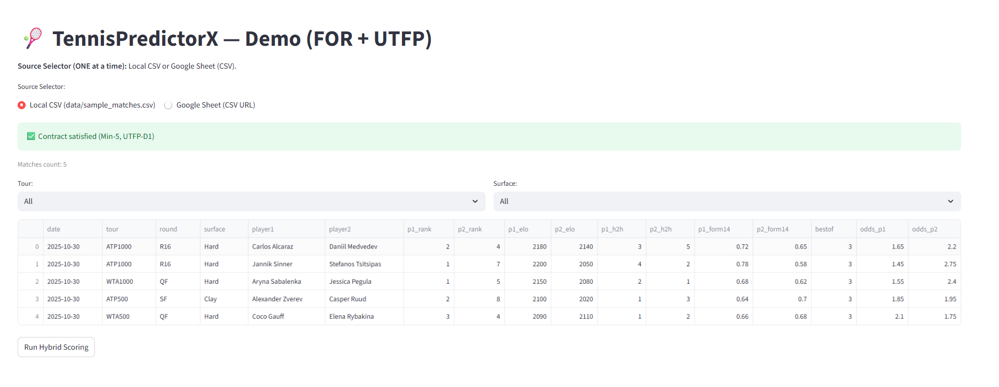

# 🎾 TennisPredictorX — Demo (FOR + UTFP)

## Overview
Production-ready tennis match predictor with:
- **Hybrid Scoring** → `p1_prob`, `p2_prob`, `pred_winner`, `confidence_band`
- **Filters** → Tour / Surface
- **Visualization** → Confidence histogram
- **Download** → CSV export

## Quick Start
~~~powershell
python -m venv .venv
.\.venv\Scripts\activate
pip install -r requirements.txt
streamlit run app\streamlit_app.py
~~~

## Minimum Schema (Min-5)
| Column | Description |
|---|---|
| match_date | YYYY-MM-DD |
| tour | e.g., ATP1000 / WTA500 |
| surface | Hard / Clay / Grass |
| player1 / player2 | Player names |
| elo_p1 / elo_p2 | Elo ratings |
| rank_p1 / rank_p2 | Rankings |
| h2h_p1 / h2h_p2 | H2H counts |
| form14_p1 / form14_p2 | Recent form (0-1) |
| odds_p1 / odds_p2 | Decimal odds |

## Screenshots

## Deploy – Streamlit Cloud
1) Push to GitHub  
2) On Streamlit Cloud, set **Main file path**: `app/streamlit_app.py`  
3) Secrets (if any): not required for the demo

## License
MIT — see [LICENSE](LICENSE).
